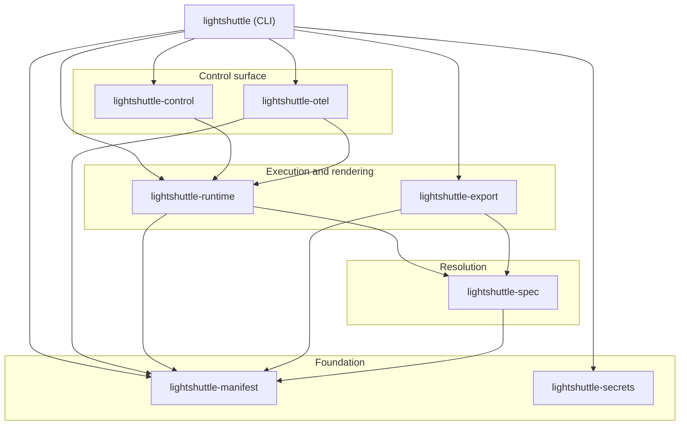

# The crate architecture

LightShuttle is a single Cargo workspace split into focused crates. The split
is not cosmetic: it encodes one rule that keeps the project honest as it grows.
The manifest model, which is the domain, depends on nothing internal, and every
other crate depends toward it. Reading the graph below from the bottom up is
reading the project from its core outward.

An arrow reads "depends on". Notice that no arrow ever points back down: the
foundation never imports the layers above it.

## The dependency rule

The arrows only flow one way, from the concrete toward the abstract. The
domain, how a `lightshuttle.yml` is shaped and validated, lives in
`lightshuttle-manifest` and pulls in no other LightShuttle crate. The details,
how a resource becomes a running Docker container, how the result is exported
to Compose or Helm, how telemetry is collected, all sit above it and depend on
it, never the reverse.

This is what lets the project stay testable and swappable. The runtime targets
a narrow `ContainerRuntime` trait rather than Docker directly, so the lifecycle
logic can be exercised against a mock with no daemon in sight. A second backend
could be added without touching the manifest model. The rule is the reason a
change to "how we talk to Docker" cannot ripple down into "what a manifest
means".

## The layers

**Foundation.** `lightshuttle-manifest` is the strongly typed model of the
manifest: the parser, the `${...}` interpolation engine, the validation pass
that catches naming, dependency and reference mistakes, and the JSON Schema
generator. `lightshuttle-secrets` is a standalone helper for loading and
checking environment variables. Both are pure: no Docker, no network, no HTTP.

**Resolution.** `lightshuttle-spec` is the bridge between intent and execution.
It resolves one manifest resource into a `ContainerSpec`, the self-contained
description of a container to start, together with the `outputs` that resource
exposes to its dependents (its `host`, `port`, `url`, and so on). This is where
a declarative `postgres:` block becomes concrete defaults like image `16`, user
`postgres`, port `5432`.

**Execution and rendering.** `lightshuttle-runtime` owns the `ContainerRuntime`
trait, its `DockerRuntime` implementation, and the `LifecycleManager` that
coordinates startup, supervision and shutdown of a whole stack. The same
resolved model is reused by `lightshuttle-export`, which follows a compiler
shape: it lowers the manifest into a neutral export model, then an emitter
renders that model into Compose, Helm or Kubernetes artifacts. One resolution
feeds both "run it now" and "ship it elsewhere".

**Control surface.** `lightshuttle-control` is the developer-facing plane that
runs alongside a stack: a REST API, a WebSocket log stream and a server-rendered
dashboard, all bound to `127.0.0.1`. CLI subcommands such as `restart` are thin
HTTP clients of these same endpoints. `lightshuttle-otel` bundles an
OpenTelemetry collector container and injects the environment that wires the
stack to it. Both observe or steer the runtime; neither is on its critical path.

**Composition root.** The `lightshuttle` crate is where everything is wired
together. It holds the `clap` command tree and the per-command implementations,
and the binary itself is a thin shim over its `run` entry point. Because the
command tree is library code, the workspace tooling can read it to generate the
[CLI reference](../reference/cli/index.md) instead of hand-maintaining it.

## Where to go next

- To see how the runtime turns this static graph into a running, ordered stack,
  read [The resource lifecycle](lifecycle.md).
- To understand how resolved resources find each other at runtime, read
  [Networking and service discovery](networking.md).
- For the exact shape of every manifest field, see the
  [manifest reference](../reference/manifest/index.md).
